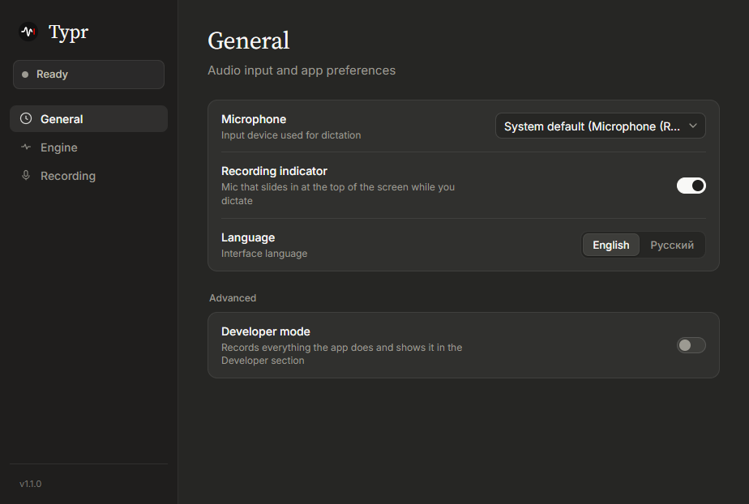

<p align="center">
  
</p>

<h1 align="center">Typr</h1>

<p align="center">
  <a href="README.md">English</a> · <b>Русский</b>
</p>

Typr — лёгкое приложение для голосового ввода на Windows. Нажимаешь глобальный хоткей, говоришь, и распознанный текст вставляется в активное окно.

<p align="center">
  
</p>

## Возможности

- **Мастер настройки** при первом запуске: язык интерфейса, способ распознавания (с рекомендацией для этого компьютера), модель или ключ, хоткей.
- **Глобальный хоткей** в двух режимах: сочетание клавиш или одна кнопка мыши (средняя или боковая).
- **Локальное распознавание** через [transcribe.cpp](https://github.com/handy-computer/transcribe.cpp): Parakeet TDT 0.6B v3, Whisper Large v3, Large v3 Turbo и Medium работают прямо на компьютере, звук никуда не уходит. Работают на видеокарте через Vulkan (NVIDIA, AMD или Intel) или на процессоре. Модели скачиваются и удаляются в настройках, неиспользуемая модель сама выгружается из памяти.
- **Облачные провайдеры распознавания:** Groq (Whisper Large v3/v3 Turbo), [Polza.AI](https://polza.ai/), [AssemblyAI](https://www.assemblyai.com/) (Universal-3.5 Pro/Universal-2), а также любой OpenAI-совместимый эндпоинт. Запись уходит в FLAC, где сервис его принимает, по соединению, открытому, пока вы говорите.
- **Запасной локальный движок:** если облако не справилось, диктовку распознает скачанная локальная модель; следующая снова пойдёт в облако.
- **Язык речи:** определяется автоматически или задаётся (русский, английский и другие) — так точнее распознаются короткие фразы.
- **Постобработка:** нейросеть (Gemini, OpenRouter, Groq или Polza) дорабатывает текст перед вставкой в одном из стилей: «Чилл», «Грамотный» или свой.
- **Чистый буфер обмена:** продиктованный текст вставляется через буфер, не попадает в журнал буфера Windows.
- **Пробел после текста**, чтобы следующая фраза не слипалась с предыдущей.
- **Меню в трее:** вставить последнюю диктовку ещё раз, сменить движок, открыть настройки, выключить хоткей.
- **Запуск вместе с Windows** (по желанию) и **проверка новых версий на GitHub.**
- **Индикатор записи:** маленький микрофон выезжает из-за верхнего края экрана только во время диктовки (запись, распознавание, вставка) и снова прячется.
- **Минимум памяти:** около 5 МБ ОЗУ в трее! WebView окна настроек выгружается после закрытия, а индикатор записи рисуется нативно.
- **Режим разработчика:** живой лог всего, что делает приложение, для поиска проблем.
- **Интерфейс на русском и английском.**
- Тёмный минималистичный интерфейс в стиле Anthropic.

## Сборка

Установщик собирает GitHub Actions (`.github/workflows/build.yml`) при пуше тега вида `v*` или при ручном запуске workflow:

```bash
git tag v2.0.0
git push origin v2.0.0
```

Для локальной разработки нужны [Rust](https://rustup.rs/) и [Node.js](https://nodejs.org/) 20+:

```bash
npm install
npm run tauri dev
```

Сделано на [Tauri 2](https://tauri.app/) (Rust) и чистом TypeScript.

## Авторы

- Оригинальный проект — [albertshiney](https://github.com/albertshiney/typr)
- Форк ведёт [neodym121](https://github.com/neodym121), доработан вместе с [Claude](https://claude.com/claude-code) (Anthropic)

## Лицензия

[MIT](LICENSE)
